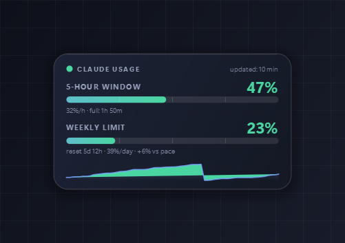

# Claude Usage Monitor

**An always-on-top desktop panel for Windows 11 that shows how much of your Claude subscription you have left — your 5-hour window and your weekly limit, updated live.**

[](LICENSE)
[](#installation)
[](#run-from-source)
[](#languages)

<p align="center">
  
  <br>
  <em>The panel — 5-hour window on top, weekly quota below, with trend curve and pace.</em>
</p>

No more guessing whether you can start that one more long conversation. The panel sits on
your desktop (or shrinks into the tray), shows the percentage used, counts down to the next
reset, and tells you whether you are burning through your weekly limit faster than the week
is passing.

**Read this in other languages:** [Magyar](README.hu.md)

---

## Features

- **Both limits at a glance** — the 5-hour rolling window and the weekly quota, side by side.
- **Per-model weekly limit** (claude.ai source) — a third gauge between them for the model you
  care about (default **Fable**; change it in Settings → Content). Shown only when the server
  reports a model-scoped limit. It can be switched off on its own, its **size** is adjustable
  (0.5×–2×) and the **order** of the three gauges is yours to choose — all from the
  right-click menu or Settings → Content.
- **Plan badge** (claude.ai source) — a small gradient pill in the header: PRO, MAX 5×, MAX 20×,
  TEAM or ENTERPRISE; hover it for the plan card. Your name only shows if you ask for it.
- **Every other limit, as a small list** under the gauges — the other models' weekly windows,
  per-surface windows (Claude Code, connected apps…), limits the app does not know by name yet,
  and **extra usage** (pay-as-you-go: on/off, monthly limit, spent). Each category *and each
  single line* can be switched off in Settings → Details or from the right-click menu.
- **Pace warning** — not just "62% used", but *"+12% ahead of pace"*, so you know whether
  you'll run out before the week does.
- **Projection to end of week** — turns red if your current rate would take you past 100%.
- **Two data sources** — a fully offline mode that reads Claude Desktop's local log, or a
  claude.ai sign-in that covers *all* your devices with exact reset timestamps.
- **Tray icon with a progress ring** — hover for the full breakdown, or hide the panel
  entirely and keep just the icon.
- **History window** — 6h / 24h / 7d / all-time charts with threshold lines, plus stats.
- **6 themes, 3 layouts** — post-it card, thin bar, or rings. Custom accent color,
  adjustable size and opacity, edge snapping, click-through "decoration only" mode.
- **Alerts** — configurable warning and critical thresholds (70% / 90% by default), plus
  notifications on quota reset and stale data.
- **12 languages** — the entire interface (panel, menu, tray, settings, history and sign-in),
  auto-detected from Windows.
- **Starts with Windows** via a proper Scheduled Task (more reliable than a Run registry key),
  and adds a **Start menu** shortcut.

## Installation

### Download (recommended)

1. Download the latest package from **<https://dinorr.hu/claude-usage-monitor/>**
   (also on the [Releases](../../releases) page).
2. **Extract the whole zip**, then double-click `INSTALL.bat`.
3. Answer two questions (desktop shortcut, start with Windows). The app starts by itself.

No Python and no admin rights are needed. The installer copies the program to
`%LOCALAPPDATA%\Programs\ClaudeUsageMonitor`, adds a Start menu shortcut and registers a proper
entry (with uninstaller) under *Settings → Apps → Installed apps*. Installing over an older
version is an upgrade - settings and the claude.ai sign-in are kept. Silent install for admins:
`installer\Install.ps1 -Silent`.

### Updates

The app looks at the release manifest a few seconds after start and every 6 hours. When a newer
version exists it tells you (tray notification, a small `↑ version` marker on the panel, and the
right-click menu). **Install now** downloads the package, verifies its **SHA-256**, unpacks it
next to the installed folder, swaps the folders after the app has exited, and restarts - if
anything fails, the old version is put back. HTTPS only, and the download must come from the
same host as the manifest. Switch the check off in *Settings → System*. From the command line:
`ClaudeUsageMonitor.exe --check-update` / `--update-now` (result in `update.log`).

> The package is deliberately **not** a single-file exe: onefile builds unpack to `TEMP` on
> every launch, which caused hangs during sign-in. This way startup is instant. Keep the
> whole folder together (~120 MB).

> **Unsigned build.** This is a community project and the exe is not code-signed, so Windows
> SmartScreen may warn on first run (More info → Run anyway). It's open source — read the
> code, or [build it yourself](#run-from-source). See [Privacy](#privacy) for what it does
> and does not touch.

### Run from source

```bash
git clone https://github.com/gaborvidovics76/ClaudeUsageMonitor.git
cd ClaudeUsageMonitor
pip install -r requirements.txt
python main.py
```

To rebuild the exe (output lands in `dist\ClaudeUsageMonitor`):

```bash
powershell -ExecutionPolicy Bypass -File build.ps1
```

## Where the data comes from

The app has two measurement sources, switchable from the right-click menu or
**Settings → Data source**.

### 1. Local log — default, no sign-in

Reads **Claude Desktop**'s own usage history file:

```
%APPDATA%\Claude\plan-usage-history.json
```

- No login, no password, no API key. Nothing is sent anywhere.
- Measures **this machine only**, and only while Claude Desktop is running.
- Refreshes roughly every 5 minutes (that's how often Desktop writes), so reset times are
  approximations.

### 2. claude.ai — OAuth sign-in, all devices

The same flow **Claude Code** uses. You sign in **in your system browser**, where your saved
passwords and passkeys already work — there is no embedded browser:

1. The app opens the sign-in page in your browser.
2. You log in and approve access; you get a code at the end.
3. Paste the code into the app. Done.

- Covers **all your devices** (browser, another machine, phone).
- **Exact reset timestamps** from the server, not estimates.
- Polls about every 2 minutes. The usage endpoint rate-limits faster polling (HTTP 429), so the
  app adapts its pace, retries by itself, and **shows what it is doing**: a spinning ring and
  “refreshing…” while a request runs, a countdown to the retry when the server pushed back.
  **Refresh now** keeps trying until it gets an answer.
- **No developer or admin knowledge needed.**
- Tokens (access + refresh) are stored **encrypted with Windows DPAPI**, bound to your
  Windows account, and refresh automatically. Sign out from the menu at any time.
- Requests go to `https://api.anthropic.com/api/oauth/usage`, only for your own account.

## Backup status (optional)

For people who run a two-step backup script set (vault + files → OneDrive, then → Nextcloud via
rclone), a discreet status bar at the bottom of the panel shows three traffic-light lamps —
**OneDrive**, **Nextcloud**, **Obsidian**. It is **off until you configure it**: nothing about
any machine is built into the program. Where your backups live comes from your own
`%APPDATA%\ClaudeUsageMonitor\backup_profile.json` (see
[docs/backup_profile.example.json](docs/backup_profile.example.json)) or from *Settings → Backups*.

- **green** — the last successful backup is not older than 24 hours,
- **yellow** — older than 24 but not older than 48 hours,
- **red** — older than 48 hours, or no backup at all. A red ring around a lamp means the most
  recent run failed or did not finish.

A run only counts if its log ends with the script's own success line; failed runs, early exits
and rclone dry runs do not. **Click a lamp** to see what is backed up: every copied component
with source, destination and size, the files uploaded to Nextcloud, the folders and latest
notes inside the Obsidian snapshot, remote storage, errors, the scheduled tasks and the log.
Everything is configurable in **Settings → Backups** (lamps, labels, hour limits, folders,
details sections). The check runs on a background thread every 5 minutes, reads only, and never
opens OneDrive online-only files.

## Controls

| Action | Effect |
|---|---|
| Left-click + drag | move the panel (snaps to screen edges) |
| Right-click | menu (layout, theme, size, language, trend curve on/off, model gauge on/off + size + order, settings, quit) |
| Double-click | history and statistics window |
| Ctrl + scroll wheel | resize |
| Tray icon: single click | hide / show the panel |
| Tray icon: double click | history |
| Tray icon: right click | same menu (including "start with Windows") |

> Windows 11 puts new tray icons in the hidden overflow area (behind the `^` arrow) at
> first. To keep it visible, drag it out onto the taskbar, or go to
> Settings → Personalization → Taskbar → Other system tray icons.

## What it shows

**Panel**

- **5-hour window**: current %, countdown to reset, burn rate (%/hour), and an estimate of
  when you'd hit the limit at that rate.
- **Weekly quota**: current %, time left until the weekly reset, daily rate, and **pace** —
  how far ahead or behind you are versus even weekly consumption
  (`+12% ahead of pace` = you're burning it too fast).
- Trend curve for the recent period.
- Colors shift with the thresholds: green → yellow → red.

**History window** (double-click)

- 6h / 24h / 7d / full timeline for both limits, with threshold lines. Measurement gaps
  (when Claude Desktop wasn't running) show as broken lines.
- Stats: current weekly, weekly peak, average daily burn, number of 5-hour windows, and the
  **projection for the end of the week** — highlighted in red if it would exceed 100%.

**Tray icon**: the chosen metric as a percentage inside a progress ring; hover for details.

## Settings

- **Appearance** — 6 themes (Midnight Glass, Claude Warm Dark, Graphite, Neon, Light Paper,
  Post-it Yellow), custom accent color, 3 layouts (post-it card / thin bar / rings), size,
  opacity, always-on-top, lock position, edge snapping, show as taskbar window,
  click-through (decoration-only mode).
- **Content** — which limits to show (5-hour, per-model weekly, weekly), the model to track,
  the model gauge's size, the order of the gauges, trend curve, rate, countdown, freshness;
  which value the tray icon displays.
- **Alerts** — warning and critical thresholds (70% / 90% by default), notifications on
  threshold crossing, quota reset, and stale data.
- **Data source** — profile (if you have multiple accounts), refresh interval, custom data file.
- **System** — autostart, settings folder, restore defaults.

Settings live in `%APPDATA%\ClaudeUsageMonitor\settings.json` and can be edited by hand.

## Start with Windows

Toggle it from the right-click menu or **Settings → System**. It creates a Scheduled Task
named `ClaudeUsageMonitor` (Task Scheduler), triggered on logon with a 20-second delay and
3 retries on failure. This is more reliable than the `Run` registry key, which stays as a
fallback if the task can't be created. If you move the folder, the app fixes the entry on
next launch. It also adds a **Start menu** shortcut (toggle: right-click → *Show in Start menu*).

From the command line:

```
ClaudeUsageMonitor.exe --enable-autostart
ClaudeUsageMonitor.exe --disable-autostart
```

Startup log (in case it ever fails to launch): `%APPDATA%\ClaudeUsageMonitor\startup.log`

## Troubleshooting

**No data appears**

1. Is Claude Desktop running? Start it and wait one measurement cycle (up to 5 minutes).
2. Does `%APPDATA%\Claude\plan-usage-history.json` exist? If it lives elsewhere, point to it
   in Settings → Data source.
3. Multiple accounts? Pick the right profile in the same place.

## Languages

The **entire interface** is available in **12 languages** — panel, menu, tray, notifications,
settings, history and the sign-in window: English, Hungarian, German, French, Spanish, Italian,
Portuguese, Polish, Dutch, Russian, Czech, Turkish. On first launch it picks up your
**Windows language** if supported, and falls back to English. You can switch manually from
**right-click → Language**; the choice is remembered.

**Adding a language is easy** and a great first contribution: add your code to `LANG_NAMES`
in [claude_usage/i18n.py](claude_usage/i18n.py) and fill in translations for the `STRINGS`
keys. Anything missing falls back to English. See [CONTRIBUTING.md](CONTRIBUTING.md).

## Privacy

- The local-log mode sends **nothing** anywhere — it only reads a file on your own disk.
- The claude.ai mode talks only to Anthropic's own API, only for your own account's usage.
- OAuth tokens are encrypted with Windows DPAPI and never leave your machine.
- There is no telemetry, no analytics, and no third-party service of any kind.

## Contributing

Issues and pull requests are welcome — new translations especially, they take about 20
minutes. See [CONTRIBUTING.md](CONTRIBUTING.md).

## Disclaimer

This is an unofficial, community-built tool. It is not affiliated with, endorsed by, or
supported by Anthropic. "Claude" is a trademark of Anthropic, PBC.

## License

[MIT](LICENSE)

## macOS

The same program runs on macOS (menu bar icon instead of a tray icon, the sign-in token in the
Keychain, start at login through a LaunchAgent). Download it from the same page, or build it
yourself on a Mac with one command - see [macos/START-HERE.md](macos/START-HERE.md)
([magyarul](macos/KEZDD-ITT.md)). The Windows release is the base of the project; macOS builds are
made from the same source and published separately, so the two never get in each other's way.
